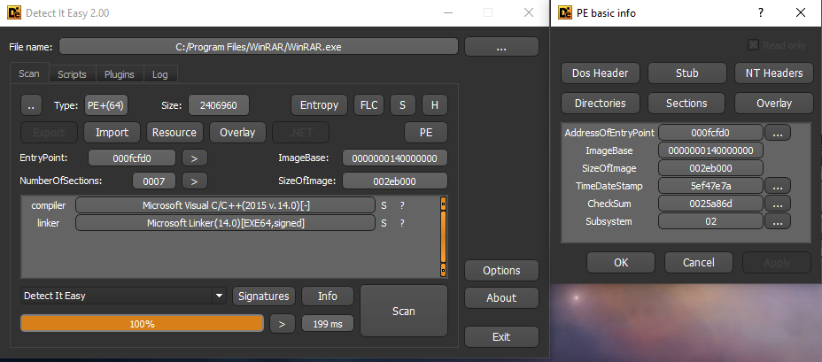
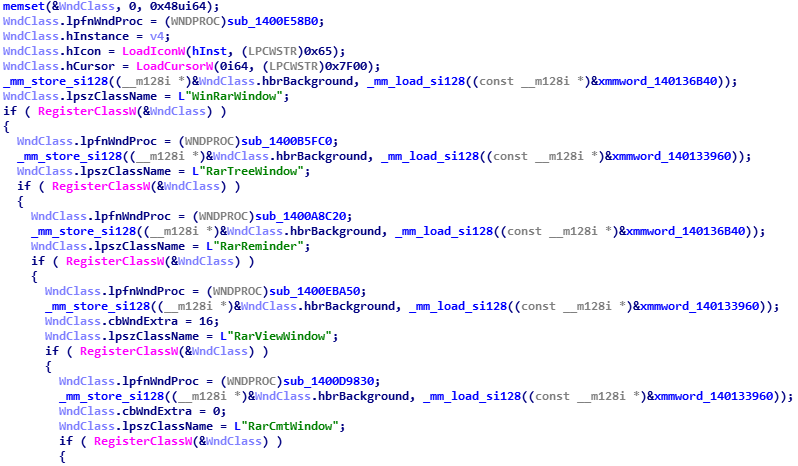
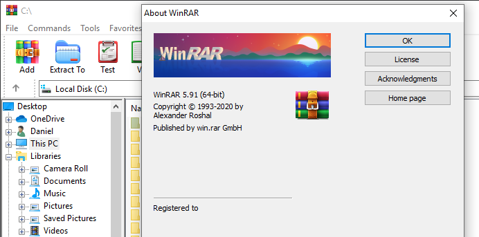

##### 0x0 intro

Some of you might remember the WinRAR RCE vulnerability (dropped around 2019) ever since it seems like WinRAR gets updated more frequently,
It got me curious & decided to challenge myself to try and analyse WinRAR, more precisely - get rid of the annoying and infinite 'Expired Notification' and 'Please purchase WinRAR license' windows.

The first thing I usually do when working on any binary is to identify what type of binary, architecture, compiler information and generally viewing pe information etc.. \
my go-to tool for this is 'detect it easy' (DIE for short) which has dozens of signatures to detect various packers, crypters and protectors moreover the ability to run scripts and plugins and its open source,
I will also be using IDA for static analysis.


**looks like our binary is 64-bit compiled with MSVC**

finding our main function is relatively easy, each PE file has a field called [Subsystem](https://docs.microsoft.com/en-us/windows/win32/debug/pe-format#windows-subsystem) inside [IMAGE_OPTIONAL_HEADER](https://docs.microsoft.com/en-us/windows/win32/api/winnt/ns-winnt-image_optional_header64) 
structure, the subsystem determines how the kernel should prepare the environment for the program based on the entry-point function the application compiled with.

* IMAGE_SUBSYSTEM_WINDOWS_GUI (0x2) - means our program is GUI application defined by using [WinMain](https://docs.microsoft.com/en-us/windows/win32/api/winbase/nf-winbase-winmain)
* IMAGE_SUBSYSTEM_WINDOWS_CUI (0x3) - defined by using main() function usually this is standard C++ entry point, the OS will attach console window to this process

before we start diving into our analysis it is worth to mention that on 64-bit binaries will use __fastcall calling convention by default
meaning arguments are passed in this order \
rcx - first arg \
rdx - second arg \
r8  - third arg \
r9  - fourth arg \
the rest are passed through the stack

##### 0x1 analysis

using DIE we see our subsystem value is 0x2 so inside our entrypoint we search for a function call with 4 arguments whereas rcx is 0x140000000

```cpp
0x1400FCF5F - mov     r8, rax         ; lpCmdLine
0x1400FCF62 - mov     r9d, ebx        ; nShowCmd
0x1400FCF65 - xor     edx, edx        ; hPrevInstance
0x1400FCF67 - lea     rcx, cs:140000000h ; hInstance
0x1400FCF6E - call    WinMain         ; IDA has already detected & renamed it
```

inside our main function we have 5 calls to [RegisterClassW](https://docs.microsoft.com/en-us/windows/win32/api/winuser/nf-winuser-registerclassw),
it initialises [WndClass](https://docs.microsoft.com/en-us/windows/win32/api/winuser/ns-winuser-wndclassa)
struct at the beginning but each call it sets different **lpfnWndProc** (function-pointer/callback which is responsible for most of the behaviour of the window), **lpszClassName** (string which specifies the window class name) and **hbrBackground** (handle to class background brush).



judging by the strings used for lpszClassName (uhm "RarReminder") we can assume the same strings are used for CreateWindow api, cross reference "RarReminder" string leads to

```cpp
0x1400A9788 - mov     rcx, cs:hInstance
0x1400A978F - lea     r8, WindowName              ; "WinRAR"
0x1400A9796 - mov     [rsp+10A8h+lpParam], r15    ;
0x1400A979B - lea     rdx, aRarreminder           ; "RarReminder"
0x1400A97A2 - mov     [rsp+10A8h+hInstance], rcx  ; hInstance
0x1400A97A7 - mov     r9d, esi                    ; dwStyle
0x1400A97AA - mov     [rsp+10A8h+hMenu], r15      ; hMenu
0x1400A97AF - xor     ecx, ecx                    ; dwExStyle
0x1400A97B1 - mov     [rsp+10A8h+hWndParent], r15 ; hWndParent
0x1400A97B6 - mov     [rsp+10A8h+nHeight], r14d   ; nHeight
0x1400A97BB - mov     [rsp+10A8h+nWidth], ebp     ; nWidth
0x1400A97BF - mov     [rsp+10A8h+Y], edi          ; Y
0x1400A97C3 - mov     [rsp+10A8h+X], ebx          ; X
0x1400A97C7 - call    cs:CreateWindowExW
```

We could NOP (refers to replacing the assembly with 'no operation' opcode which as the name suggest - does nothing)
the call above 'CreateWindowExW' by using any hex editor simply find the RVA offset or search by pattern and replace the hex bytes with 0x90.
Launching our patched winrar it seems 'expired notification' window is gone but it's not convenient to NOP window creation but preferably finding the subroutine that checks for registration.

Few lines below we have this call

```cpp
0x1400A981F - mov     rcx, cs:hInst     ; hInstance
0x1400A9826 - lea     r9, sub_1400E27F0 ; lpDialogFunc
0x1400A982D - mov     r8, rax           ; hWndParent
0x1400A9830 - mov     qword ptr [rsp+10A8h+X], r15 ; dwInitParam
0x1400A9835 - lea     rdx, aReminder    ; "REMINDER"
0x1400A983C - call    cs:DialogBoxParamW
```

[DialogBoxParamW](https://docs.microsoft.com/en-us/windows/win32/api/winuser/nf-winuser-dialogboxparama)
is basically a wrapper for [looping messages](https://en.wikipedia.org/wiki/Message_loop_in_Microsoft_Windows)
and window creation, it will call CreateWindow to create the dialog box, sub_1400E27F0 is the dialog procedure inside it contains strings such as "HELPLicenseAndRegistering", "REMINDER", "order.htm"
which might be related to our 'Please purchase WinRAR license' window. DialogBoxParamW is called only if dil (in x64 dil is lowest 8 bits of rdi register) is non-zero value which is determined by sub_1400620E8 return value- if it returns zero it sets dil to one and vice versa.

```cpp
0x1400A938B - xor     r15d, r15d
0x1400A93A6 - mov     r12d, 1
...
0x1400A9495 - call    sub_1400620E8
0x1400A949A - test    al, al     // al is the low 8 bits of rax
0x1400A949C - jnz     short loc_1400A94AA
...
0x1400A94A5 - mov     dil, r12b  // set dil to 1 if sub_1400620E8 returns non-zero
...
0x1400A94AA - mov     dil, r15b  // set dil to 0 if sub_1400620E8 returns zero
...
0x1400A980D - test    dil, dil
```

sub_1400620E8 simply returns global variable 

```cpp
sub_1400620E8:
	0x1400620E8 - mov     al, cs:byte_1401954F0
	0x1400620EE - ret
```

and referenced three times in our function, here it's being called and if the return value (AL) is zero don't take the jump, in other words continue calling functions below while pushing "Interface\\Misc", "RemShown" strings as arguments with different r8

```cpp
0x1400A951C - lea     rsi, aInterfaceMisc ; "Interface\\Misc"
...
0x1400A952B - call    sub_1400620E8
0x1400A9530 - test    al, al
0x1400A9532 - jnz     short loc_1400A957D ; dont jump is al == zero
0x1400A9534 - xor     r8d, r8d
0x1400A9537 - lea     rdx, aRemshown      ; "RemShown"
0x1400A953E - mov     rcx, rsi
0x1400A9541 - call    sub_1400A789C       ; read registry
0x1400A9546 - cmp     eax, cs:dword_14015DFA8
0x1400A954C - jnb     short loc_1400A957D ; 
0x1400A954E - lea     r8d, [rax+1]
0x1400A9552 - mov     rcx, rsi
0x1400A9555 - lea     rdx, aRemshown      ; "RemShown"
0x1400A955C - call    sub_1400A84D8       ; write registry
```

these are wrapper functions used for reading and writing registry keys, their implementation is pretty simple and straightforward it will append "Interface\\Misc" to "Software\\WinRAR" which is the key path 
and uses [RegQueryValueExW](https://docs.microsoft.com/en-us/windows/win32/api/winreg/nf-winreg-regqueryvalueexw) to read and [RegSetValueExW](https://docs.microsoft.com/en-us/windows/win32/api/winreg/nf-winreg-regsetvalueexw) to write. \
I won't go into full detail of explaining the registry, all you need to know is that it is database structured in a tree format, to run registry editor simply open a run prompt (windows key + R) and type "regedit", 
navigate to "HKEY_CURRENT_USER\\Software\\WinRAR\\Interface\\Misc\\" ```RemShown``` is set at 1 if we modify the value to 0 and relaunch winrar this window pops up


after this window is shown registry shows ```RemShown``` value has changed to 1. \
so in essence we have a subroutine- that if returns non-zero value will skip creating dialog related to purchasing and reading registry keys to determine if 'reminder' window has shown, it is safe to presume this subroutine could indicate if winrar has registered. \
we can change sub_1400620E8 to always return true by changing the assembly from ```mov al, cs:byte_1401954F0``` to ```mov al, 0x1``` or even change the global variable value using any memory editor (cheat engine for example) base_address + 0x1954F0



and it appears WinRAR title no longer contains "evaluation copy" string. \
cross reference this global variable (base_address + 0x1954F0) shows it is being used twice, in the second subroutine it moves cl (lowest 8 bit of rcx register) which is the function parameter to our global variable

```cpp
sub_140062268:
	0x140062268 - mov     cs:byte_1401954F0, cl
	0x14006226E - ret
```

basically sub_140062268 sets winrar registration state according to the byte it receives.

to sum up this writeup it does not cover generating keys for winrar but rather my approach on doing static analysis and modifying winrar memory and how I found the registration routine.
this analysis was done on 5.91 winrar version(MD5 ```715065F9ADF100230AFCB91D99316050```)