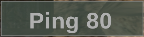
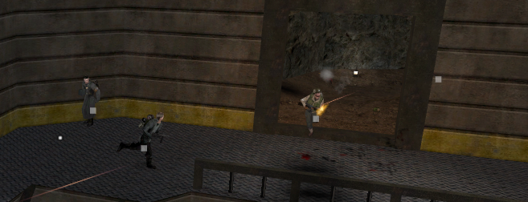

I've recently downloaded [enemy territory: legacy](https://www.etlegacy.com/) it is based on the source code of one of my favorite games growing up [wolfenstein: enemy territory](https://en.wikipedia.org/wiki/Wolfenstein:_Enemy_Territory) and it's arguably the best FPS game out there,
Legacy is bascially an updated version of the original game which released in 2003 and they aim to improve and fix any bugs and exploits while making the game more modern.
It never ceases to amaze me that even after almost 20 years the community is alive and active and people still playing anyways
while I was playing the game I realized how rusty I was playing with rifle grenade when picking engineer (specifically throwing nades) 
so I searched for any console command to view the grenade trajectory (draw a grenade path when pulling the pin) to practice offline and was suprised to discover the game doesn't have any,
so I thought since legacy is [open sourced](https://github.com/etlegacy/etlegacy) on github it makes our process of reversing a game & creating a hack much easier and it would be a great opportunity to show you my approach on implementing such feature, 
I'll be using IDA for the static analysis but any kind of disassembly tool (even a debugger) is fine.
In addition to 'reversing' the game I will write a DLL in C++ to read and manipulate the memory internally, this method will require a loader(also referred as injector) to load our DLL into the game process,
personally I'll be using [my own](https://github.com/DanielKoren/mazrek) but feel free to use [any](https://www.unknowncheats.me/forum/general-programming-and-reversing/213038-extreme-injector-v3-7-a.html) out of the dozens released on various forums.
This can be done externally meaning we can manipulate the memory using ```.exe``` but I prefer creating a DLL since its more efficient, easier when hooking/calling game functions and generally has better performance.

_This post is aimed towards folks who have basic understanding of game hacking & C/C++, I'd also like to point out that I've never messed with quake games prior this so any feedback/critism is welcomed!_

##### 0x00 game engine

Before we start diving into reversing it's important to understand the layout of the game, ET has various addons(mods) such as ETJump, Jaymod, ETPro, ETPub, Legacy & more. \
Each mod has its own pros and cons and it basically controls the client-side modification.\
When connecting to any server the main executable will load ```cgame_mp_x86.dll``` which is the mod located in ```Users\Daniel\Documents\ETLegacy\*modname*\cgame_mp_x86.dll```. \
```cgame_mp_x86.dll``` exports 2 important functions for the main executable to call ```vmMain()``` acts as a dispatcher it will redirect any commands and parameters given from the main executable and ```dllEntry()``` 
that stores syscall pointer into a global variable which is used for the main executable to call for example to read files or indicate a critical error.
I'd also like to point out that CG_ prefix stands for **c**lient **g**ame.

```c
//https://github.com/etlegacy/etlegacy/blob/eef4d2bdb6abaa2716e993b86636084af226520a/src/cgame/cg_main.c#L64
__declspec(dllexport) intptr_t vmMain(intptr_t command, intptr_t arg0, intptr_t arg1, intptr_t arg2, intptr_t arg3, intptr_t arg4, intptr_t arg5, intptr_t arg6, intptr_t arg7, intptr_t arg8, intptr_t arg9, intptr_t arg10, intptr_t arg11)
{
	switch (command)
	{
	case CG_INIT:
		CG_Init(arg0, arg1, arg2, (qboolean)arg3, arg4, (demoPlayInfo_t *)arg5, arg6);
		cgs.initing = qfalse;
		return 0;
	case CG_SHUTDOWN:
		CG_Shutdown();
		return 0;
	case CG_DRAW_ACTIVE_FRAME:
		CG_DrawActiveFrame(arg0, (qboolean)arg2); // arg1 removed, order kept for vanilla client compatibility
		return 0;
	//...
	default:
		CG_Error("vmMain: unknown command %li", (long)command);
		break;
	}
	return -1;
}

static intptr_t(QDECL * syscall)(intptr_t arg, ...) = (intptr_t(QDECL *)(intptr_t, ...)) - 1;

//https://github.com/etlegacy/etlegacy/blob/00b35a7e14db6f0b73dd6fbf5fdfe7436a8ed776/src/game/g_syscalls.c#L42
__declspec(dllexport) void dllEntry(intptr_t(QDECL * syscallptr)(intptr_t arg, ...))
{
	syscall = syscallptr;
}

```

[here](https://github.com/etlegacy/etlegacy/blob/eef5383289017059042f93e40cd7466b5774a47e/src/cgame/cg_public.h#L333) we can see list of commands(syscalls) that the main executable can invoke, for example if ET.exe wants to shutdown it will call vmMain with CG_SHUTDOWN command to clean/flush any open files or CG_DRAW_ACTIVE_FRAME to draw stuff on the screen.
CG_INIT invoked when connecting, reconnecting, loading new map etc which will call CG_Init()

```c
//https://github.com/etlegacy/etlegacy/blob/eef4d2bdb6abaa2716e993b86636084af226520a/src/cgame/cg_main.c#L2614
void CG_Init(int serverMessageNum, int serverCommandSequence, int clientNum, qboolean demoPlayback, int etLegacyClient, demoPlayInfo_t *info, int clientVersion)
{
	const char *s;
	int        i;
	char       versionString[128];
	DEBUG_INITPROFILE_INIT

	//int startat = trap_Milliseconds();

	Com_Printf(S_COLOR_MDGREY "Initializing %s cgame " S_COLOR_GREEN ETLEGACY_VERSION "\n", MODNAME);

	// clean up the config backup if one exists
	CG_RestoreProfile();

	// clear everything
	Com_Memset(&cgs, 0, sizeof(cgs));
	Com_Memset(&cg, 0, sizeof(cg));
	Com_Memset(cg_entities, 0, sizeof(cg_entities));
	Com_Memset(cg_weapons, 0, sizeof(cg_weapons));

	cgs.initing = qtrue;
	//...
}
```
this function essentially initialises stuff related to the client but most importantly it clears these **cg_** structures using ```Com_Memset```
these 4 structures contain all the information we need, ```cg_entities``` is a global array containing all entities, ```cg``` holds info related to the client while ```cgs``` related to the server
and lastly ```cg_weapons``` might be relevant if we want to achieve wallhack for weapons.
most of these structures are defined in [src/cgame/cg_local.h](https://github.com/etlegacy/etlegacy/blob/e74807313241ebef3fbf3dc6b2b09587b4f882b5/src/cgame/cg_local.h)
```c
// from cg_local.h
extern cgs_t        cgs;
extern cg_t         cg;
extern centity_t    cg_entities[MAX_GENTITIES];
extern weaponInfo_t cg_weapons[MAX_WEAPONS];
```

##### 0x01 wallhack

the idea of wallhack is quite simple- obtain all players position in game world and transform them to our screen position and use any kind 
of API rendering (direct3d or opengl) to render boxes and names.
as we've seen previously ```CG_Init()``` function clears ```cg_entities``` structure which might be our entitylist offset (refers to an array or list in the memory of the game which contains all the entities/players in the game),
finding it in any disassembly is fairly easy- go through the exports specifically ```vmMain``` export and inside the function we want to jump to our first call that is the ```CG_Init``` function

```nasm
 // CG_Init(..)
 //...
 push    offset aLegacy  ; "legacy"
 push    offset a9initializingS ; "^9Initializing %s cgame ^2v2.77.1-261-g"...
 call    sub_100481C0		; Com_Printf(..)
 call    sub_10047790		; CG_RestoreProfile()
 push    2059414h		; sizeof(cgs)
 push    0
 push    offset dword_11B6C880	; cgs
 call    sub_100A0C10		; Com_Memset(&cgs, 0, sizeof(cgs));
 push    99F3Ch			; sizeof(cg)
 push    0
 push    offset dword_11AD2940	; cg
 call    sub_100A0C10		; Com_Memset(&cg, 0, sizeof(cg));
 push    2D5000h		; sizeof(cg_entities)
 push    0
 >> push    offset unk_117FD940	; cg_entities
 call    sub_100A0C10		; Com_Memset(cg_entities, 0, sizeof(cg_entities));
 push    41000h			; sizeof(cg_weapons)
 push    0
 push    offset dword_117BC940	; cg_weapons
 call    sub_100A0C10		; Com_Memset(cg_weapons, 0, sizeof(cg_weapons));
 //...
```
From here we could calculate the RVA offset by subtracting the base address from 0x117FD940 but I prefer creating and searching for a [pattern of bytes](../understanding-pattern-scanning/) 
as its more reliable between any game updates (cg_entities pattern ```68 ?? ?? ?? ?? E8 ?? ?? ?? ?? 68 00 10 04 00 6A 00```). \
Using ReClass or Cheat Engine we can view the memory of these structures (even reconstruct these data structures if needed)
but seems like when viewing ```cg_entities``` in memory it appears to have big chunks of null memory, 
cross-referencing ```cg_entities``` in IDA we can see where and how its being used

```nasm
 movzx   eax, byte ptr [eax+26Ch] ; eax acts as an index
 imul    edx, eax, 0B54h	  ; multiply eax with 0xB54 and store it in edx
 add     edx, offset unk_117FD940 ; add cg_entities to edx
```

I was under the impression it contains list of pointers pointing to each entity but now it makes more sense
```unk_117FD940``` is used as 'base address' and each ```centity_t``` has a size of 0xB54 bytes so accessing each entity would look something like this
```cpp
for (int i = 0; i < 64; i++)
	auto entity = (centity_t*)(cg_entities + (0xB54 * i));
```

Once we obtained a valid entitylist offset we need a way of converting each player position (x,y,z) into screen position (x,y) 
that function is known as ```world to screen``` the implementation might differ from game to game but the concept stays the same- 
it takes 4x4 matrix (16 floats) called viewmatrix that represents 4 vectors: forward, right, up (they define the orientation ot the camera) and camera position to calculate the screen position.
[CG_WorldCoordToScreenCoordFloat()](https://github.com/etlegacy/etlegacy/blob/eef5383289017059042f93e40cd7466b5774a47e/src/cgame/cg_drawtools.c#L755) does exactly what we need,
the viewmatrix is inside [refdef](https://github.com/etlegacy/etlegacy/blob/00b35a7e14db6f0b73dd6fbf5fdfe7436a8ed776/src/renderercommon/tr_types.h#L387) structure which is located in ```cg```, viewaxis in ```redef``` represents the camera while vieworg represents the camera position,
we can easily rebuild these structures by copying them from ```tr_types.h``` and ```cg_local.h```.

Now with drawing the easiest approach is to git clone any of [these](https://github.com/dvGrab/unknowncheats-directx-overlay) direct3d overlays but since the game is open-sourced
we can call the game functions to draw. [CG_FillRect](https://github.com/etlegacy/etlegacy/blob/00b35a7e14db6f0b73dd6fbf5fdfe7436a8ed776/src/cgame/cg_drawtools.c#L101)
is the function used to draw filled rectangles the params are pretty self explanitory, locating it in IDA can be done by searching for specific strings 
near the call for example "Ping %d" [here](https://github.com/etlegacy/etlegacy/blob/475909d62e8b7063d463de3fb94b87b5fd16d94d/src/cgame/cg_draw_hud.c#L2731)
displayed in the corner of the screen

```nasm
 // snippet from IDA
 mov     eax, cg_snap
 mov     ecx, 3E7h
 mov     eax, [eax+4]
 cmp     eax, ecx
 cmovl   ecx, eax
 push    ecx
 push    offset aPingD   ; "Ping %d"
 call    sub_10093E50    ; va func
 add     esp, 8
 mov     [ebp+var_C], eax
 push    offset unk_11B7DDF0
 push    0
 push    ecx
 mov     [esp+2Ch+var_2C], 3E428F5Ch
 push    eax
 call    sub_1001AC50    ; CG_Text_Width_Ext func
 cmp     eax, 34h
 mov     [ebp+var_14], eax
 mov     esi, eax
 mov     [esp+30h+var_24], 441E8000h
 cmovl   esi, edi
 add     esp, 0Ch
 mov     [ebp+var_8], esi
 call    sub_10023FD0    ; Ccg_WideX func
 movss   xmm0, [ebp+var_4]
 add     esp, 4
 fstp    [ebp+var_10]
 cvttss2si ebx, [ebp+var_10]
 push    offset unk_100DFDD8
 sub     esp, 10h
 mov     [esp+34h+var_28], 41600000h
 sub     ebx, esi
 add     esi, 5
 movd    xmm1, esi
 lea     edi, [ebx-2]
 cvtdq2ps xmm1, xmm1
 movd    xmm2, edi
 cvtdq2ps xmm2, xmm2
 movss   [esp+34h+var_2C], xmm1
 movss   [esp+34h+var_30], xmm0
 movss   [esp+34h+var_34], xmm2
 call    sub_100232F0    ; CG_FillRect func
```
```55 8B EC FF 75 18 E8 ?? ?? ?? ?? F3 0F 10 05 ?? ?? ?? ?? 83 C4 04``` \
is the pattern to find ```CG_FillRect()``` address dynamically (aka sub_100232F0) but simply calling it will crash our game because its not thread-safe,
one solution for this is to hook ```vmMain``` and draw stuff when ```CG_DRAW_ACTIVE_FRAME``` syscall is invoked, I won't be diving into hooking I feel like this topic is widely documented, I'll be using [minhook](https://github.com/TsudaKageyu/minhook)
library (its simple and minimalstic open-sourced library for hooking on windows x86 & x64)

```c
intptr_t __cdecl vmMain_hooked(intptr_t command, intptr_t arg0, intptr_t arg1, intptr_t arg2, intptr_t arg3, intptr_t arg4, intptr_t arg5, intptr_t arg6, intptr_t arg7, intptr_t arg8, intptr_t arg9, intptr_t arg10, intptr_t arg11)
{
	intptr_t result = 0;

	static float color_white[4] = { 1, 1, 1, 0.35 };

	switch (command)
	{	
	case CG_DRAW_ACTIVE_FRAME:
		for (int i = 0; i < 64; i++)
		{
			auto entity = (centity_t*)(cg_entities + (0xB54 * i));
			if (!entity)
				continue;
		
			float x, y;
			if (CG_WorldCoordToScreenCoordFloat(entity->currentState.pos.trBase, &x, &y))
			{	
				CG_FillRect(x, y, 5, 5, color_white);
			}
		}

		return vmMain_original(command, arg0, arg1, arg2, arg3, arg4, arg5, arg6, arg7, arg8, arg9, arg10, arg11);;
		
	return vmMain_original(command, arg0, arg1, arg2, arg3, arg4, arg5, arg6, arg7, arg8, arg9, arg10, arg11);
}
```
here is the wallhack in action



##### 0x02 nade trajectory

Calculating our weapon's grenade trajectory requires some sort of engine prediction to predict the path it should follow, 
using [BG_EvaluateTrajectory()](https://github.com/etlegacy/etlegacy/blob/4cff173d61164346595a620ab719451bc0339985/src/game/bg_misc.c#L3021)
we can predict the position of objects, ```trType``` describes how an object should move by using specific equations for example ```TR_LINEAR``` should move in a straight linear line while ```TR_GRAVITY``` moves in a gravity affected line,
by reading the function implementation we can guess what to initialise in ```trajectory_t```, we already know that ```trType_t``` is a set of constants describing how an object should move and we're interested in ```TR_GRAVITY```,
```trTime``` is the start time of an object, ```trDuration``` is not used in TR_GRAVITY so its irrelevant, ```trBase``` is the start position of an object and ```trDelta``` I'm not sure about it so I dug deeper in the source
and stumbled upon this structured array called [weapFireTable_t](https://github.com/etlegacy/etlegacy/blob/0715e94db4e2de1327e5bd90f4f025de0a3b5922/src/game/g_weapon.c#L4176) (in g_weapon.c)
basically its a lookup table for various flags and properties for the weapon fire etc, the ```fire``` member function is invoked by ```FireWeapon()``` when firing any weapon,
the firing function used in our table for WP_GPG40 and WP_M7 (rifle-nades that we're interested at) is [weapon_gpg40_fire()](https://github.com/etlegacy/etlegacy/blob/ae213d85181f3d41eaf2dc4fa2bb723d5407edf4/src/game/g_weapon.c#L3645),
inside the function it calls ```AngleVector()``` (function that takes our viewangles and calculates vectors that point in directions relative to our viewangles)
to obtain forward vector (vector that points in the forward facing direction) and multiplies the forward vector by 2000,
afterwards it will pass that vector to ```G_PreFilledMissileEntity()``` which initialises ```trDelta``` with it.

But still running ```BG_EvaluateTrajectory()``` in a loop isn't enough because our rifle-grenade can hit a wall and bounce or just have an impact and explode, 
[CG_Trace()](https://github.com/etlegacy/etlegacy/blob/00b35a7e14db6f0b73dd6fbf5fdfe7436a8ed776/src/cgame/cg_predict.c#L362)
allows us to trace a ray/line between 2 points in our game world and check if it hits something solid. \
first parameter is the function result that expects ```trace_t```
```c
typedef struct
{
	qboolean allsolid;      ///< if true, plane is not valid
	qboolean startsolid;    ///< if true, the initial point was in a solid area
	float fraction;         ///< time completed, 1.0 = didn't hit anything
	vec3_t endpos;          ///< final position
	cplane_t plane;         ///< surface normal at impact, transformed to world space
	int surfaceFlags;       ///< surface hit
	int contents;           ///< contents on other side of surface hit
	int entityNum;          ///< entity the contacted surface is a part of
} trace_t;
```
so if ```startsolid``` returns true or if ```fraction``` is not equal to 1.f our predicted position hits something solid,
the second param is the start position of the ray, third and fourth params are the box boundies (in our weapon fire table mins and maxs are ```{ -4.f, -4.f, 0.f }``` and ```{ 4.f, 4.f, 6.f }```), 
fifth param is the end position of the ray, sixth param is entity id to skip when enumerating all entities (we can skip our own) and lastly ```MASK_MISSILESHOT``` is our mask.
using those two functions we can predict the grenade trajectory till impact.
```c
void draw_riflenade_traj()
{
	trajectory_t rifle_traj;
	rifle_traj.trType = TR_GRAVITY;
	rifle_traj.trTime = 0;
	rifle_traj.trDuration = 0;
	VectorCopy(cg->snap->ps.origin, rifle_traj.trBase);
	rifle_traj.trBase[2] += cg->snap->ps.viewheight; // adjust the start pos
	
	vec3_t forward;
	angles_vectors(cg->snap->ps.viewangles, forward, 0, 0);
	VectorScale(forward, 2000, forward);
	VectorCopy(forward, rifle_traj.trDelta);
	
	int max_time = 3250;
	for (int cur_time = 0; cur_time < max_time; cur_time += 10)
	{
		vec3_t predicted_pos;
		BG_EvaluateTrajectory(&rifle_traj, cur_time, predicted_pos, qfalse, 0);

		trace_t rifle_trace;
		auto mins = vec3_t{ -4.f, -4.f, 0.f };
		auto maxs = vec3_t{ 4.f, 4.f, 6.f };
		CG_Trace(&rifle_trace, start_pos, mins, maxs, predicted_pos, cg->snap->ps.clientNum, MASK_MISSILESHOT);

		if (rifle_trace.startsolid || rifle_trace.fraction != 1.0)
		{
			// reflect angle and velocity
		}
		else
		{
			float x, y;
			if (CG_WorldCoordToScreenCoordFloat(predicted_pos, &x, &y))
			{
				static float color_white[4] = { 1, 0, 0, 1 };
				CG_FillRect(x - 1, y - 1, 2, 2, color_white);
			}
		}
	}
}
```
Now we're left with calculating the reflected angle and velocity, if we cross reference ```EF_BOUNCE_HALF``` constant used in eFlag (in our weapon fire table for ```WP_GPG40``` and ```WP_M7```)
we can see its being used only in [G_BounceMissile()](https://github.com/etlegacy/etlegacy/blob/0a4e50547ce904974e61b668fbb23ad6abb82011/src/game/g_missile.c#L93),
this function first checks if 750 milliseconds has passed since firing, if true then call ```G_ExplodeMissile()``` which means if our grenade travels over 750ms it will explode on impact instead of bouncing
otherwise calculate the ```hitTime``` and velocity using ```BG_EvaluateTrajectoryDelta()``` and then multiply the velocity to make sort of third bounce.

```c
hitTime = (int)(level.previousTime + (level.time - level.previousTime) * trace->fraction);
BG_EvaluateTrajectoryDelta(&ent->s.pos, hitTime, velocity, qfalse, ent->s.effect2Time);
dot = DotProduct(velocity, trace->plane.normal);
VectorMA(velocity, -2 * dot, trace->plane.normal, ent->s.pos.trDelta);
```

Using these calculations we can predict how it should bounce,
[here](https://gist.github.com/DanielKoren/a6bd218ea881eb7fc9854c4ffa3cc418) is the full code


##### 0x03 triggerbot

Lastly triggerbot, finding offset that corresponds to our aim can be really easy and its usually done by scanning changed memory using cheat engine
alternatively there's a member in ```cg``` structure called [crosshairClientNum](https://github.com/etlegacy/etlegacy/blob/8cee6c4c9de5bae3a7a0797ab962f48bf0c4a93b/src/cgame/cg_local.h#L1245) but I prefer leaving this as an excerise for the reader :)

---

<sub>references:</sub>

<sub>https://guidedhacking.com/threads/how-to-hack-call-of-duty-games-quake-engine-games.11155/</sub>
<sub>https://www.quakewiki.net/archives/code3arena/tutorials/tutorial38.shtml</sub>
