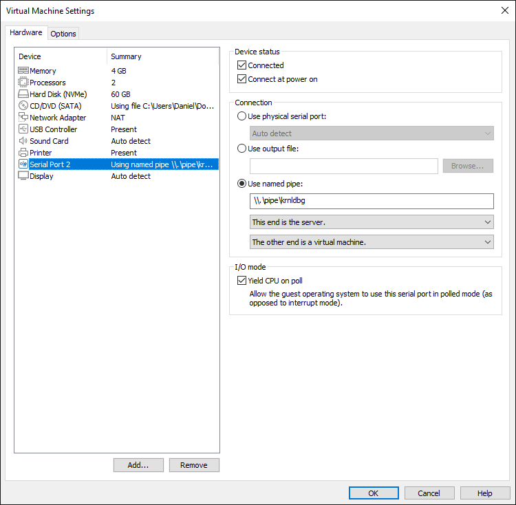
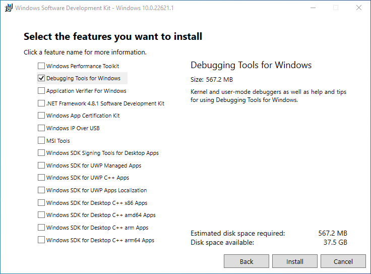
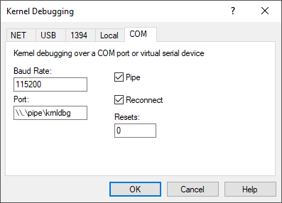
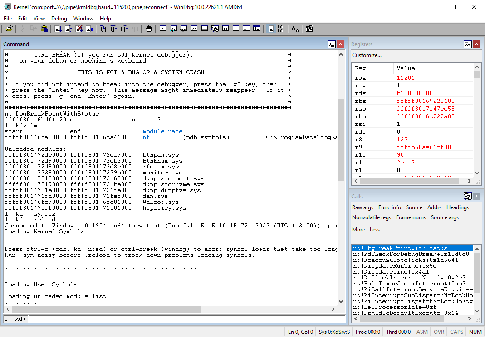

Having a proper kernel dev environment is crucial, for example if a program in user mode is accessing a null pointer address in memory the program will crash but
a driver running in kernel mode accessing a null pointer will crash our entire system (I.e. [BSOD](https://en.wikipedia.org/wiki/Blue_screen_of_death)). \
In this post I'll try to cover on how to setup an environment for remote kernel debugging using windows debugger (known as windbg) as well as setting visual studio to compile windows drivers.
I do recommend having some basic knowledge on windows internals.

###### I'll be using

* VMWare (offers a 30-day free trial)
* WinDbg (debugger connets to our VM)
* Visual Studio (and [WDK](https://en.wikipedia.org/wiki/Windows_Driver_Kit) is required)

##### VMWare

So once we have installed a fresh Windows OS on our virtual machine there are two things we need to configure 
first is creating a serial port (using a [pipe](https://docs.microsoft.com/en-us/windows/win32/ipc/pipes)) for the communication with our debugger,
this can be done by going to  __Edit virtual machine settings__ and adding a new __Serial Port__,
check __Use named pipe__ pick a name for example __\\\\.\pipe\krnldbg__ and make sure to remember the name of the pipe since it will be used for windbg later on

second thing is to enable kernel debugging in the guest machine (OS that runs in the VM) this can be done by using [bcdedit](https://docs.microsoft.com/en-us/windows-server/administration/windows-commands/bcdedit)
which is a tool used to edit boot settings, launch  __Command Prompt__ in the guest machine as administrator and type the following command
```
bcdedit /debug on
```
the following command sets the machine to use serial connection for debugging (make sure debugport matches to your serial port number shown in the previous image in my case its 2)
```
bcdedit /dbgsettings serial debugport:2 baudrate:115200 
````
and lastly enter the following command to disable driver signature enforcement which is a feature that forces Windows to load only signed drivers (to "prevent" malware)
```
bcdedit /set testsigning ON
```
I also recommend disabling Windows Defender and Windows updates but that's optional! \
now reboot your machine and you should see at the right-bottom of your screen "test mode" watermark this is due to disabling driver signature enforcement to enable it back use the __OFF__ flag in the previous command.

##### WinDbg

Downloading and installing [WinDbg](https://docs.microsoft.com/en-us/windows-hardware/drivers/debugger/debugger-download-tools) is fairly easy just download the [Windows SDK](https://developer.microsoft.com/en-us/windows/downloads/windows-sdk/) and you can leave all the options unchecked except __Debugging Tools for Windows__

once installing you'll find the executables located in ___C:\Program Files (x86)\Windows Kits\10\Debuggers\\___ either in ___x64___ or ___x86___ depends which type of architecture we're targeting.

In WinDbg go to __File__->__Kernel Debug__ and inside COM tab enter the name of your pipe \
 \
You should see a connection if you don't see a any try to break the debugger (ctrl + break), once you do
DbgBreakPointWithStatus routine should be executed which causes a break. now we can customize how windbg will look like personally I prefer using __registers__ and __call stack__ windows, 
go to __View__->__Registers__ and __Call Stack__ now your windbg should look like this

Since windbg uses a commandline to perform various stuff so [here](http://www.windbg.info/doc/1-common-cmds.html) is a good list of commands.

##### Compiling & loading .sys

Now we are left with writing some code that will be executed in the kernel space but Visual Studio doesn't come with the required kernel libraries and components to compile our driver however MSDN [provides](https://docs.microsoft.com/en-us/windows-hardware/drivers/download-the-wdk)
step by step guide, when installing the WDK make sure to keep the option __Windows Driver Kit Visual Studio extension__ checked. \
Once you're finished go ahead and create new project you should see new types of kernel projects pick 'Empty WDM Driver'.
Simply for testing puposes let's create __Main.c__ file inside the DriverEntry() which is the entry point for drivers set [DriverUnload](https://docs.microsoft.com/en-us/windows-hardware/drivers/ddi/wdm/nc-wdm-driver_unload) 
callback and use DbgPrint() routine to print some debug messages to windbg. 
```c
void UnloadFunction(PDRIVER_OBJECT driverObj)
{
	DbgPrint("testing.sys: UnloadFunction().\n");
}

NTSTATUS DriverEntry(PDRIVER_OBJECT driverObj, PUNICODE_STRING registeryPath)
{
	DbgPrint("testing.sys: DriverEntry().\n");
	driverObj->DriverUnload = UnloadFunction;

	return STATUS_SUCCESS;
}
```
To load our driver we can use tools such as [Osr Driver Loader](https://www.osronline.com/article.cfm%5Earticle=157.htm) but personally I prefer creating a simple batch script 
you will need to run these files as administrator.\
__start_driver.bat__
```batch
sc create testing binPath="c:\users\administrator\desktop\testing.sys" type=kernel
sc start testing
```
__stop_driver.bat__
```batch
sc stop testing
sc delete testing
```
If you still don't see any debug messages when loading & unloading the driver then enter the following command in windbg to enable debuggiung output
```ed nt!Kd_DEFAULT_MASK 8``` \
At this point you should see the debug messages within windbg and you can start your journey of exploring how Windows works internally.